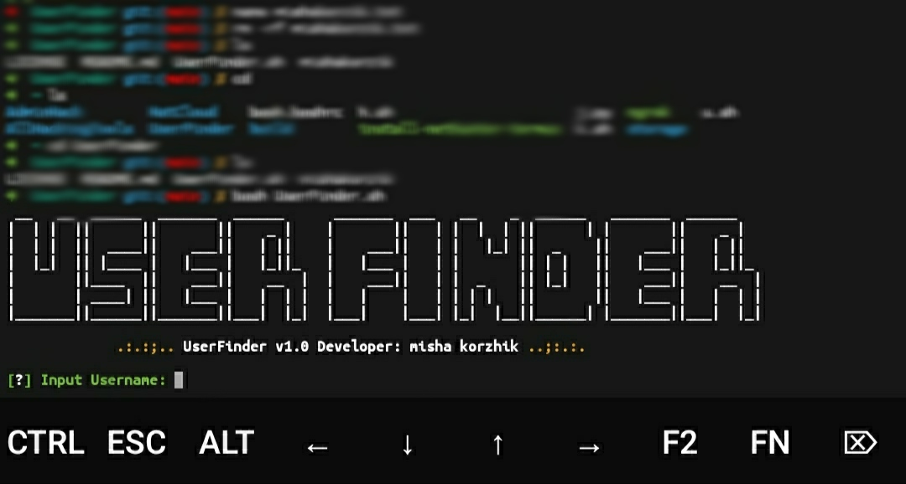

### How to Install

```
apt update
apt upgrade
apt install git
apt install curl
apt install jq
git clone https://github.com/mishakorzik/UserFinder
```

### How to Start
```
cd UserFinder
bash UserFinder.sh
```

  
### Screenshot
#### here is a `screenshot` of the UserFinder tool. As you can see, everything works well for me, without `glitches` and `lags`.

**Repository Views** 

 
  
  
